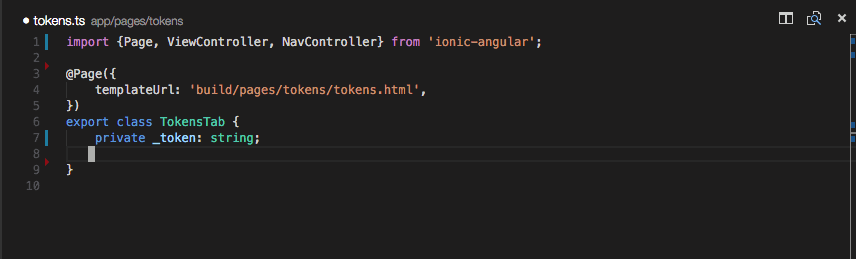
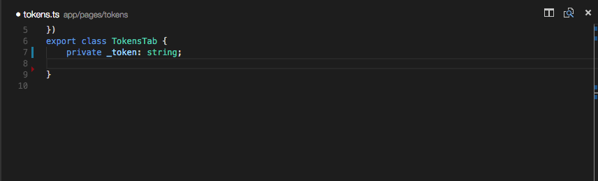
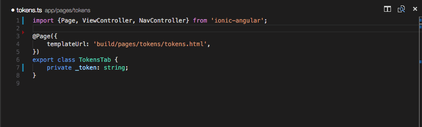
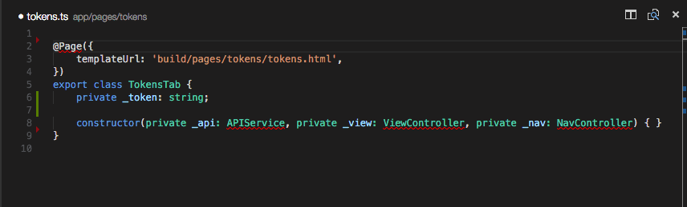

# Optimize Imports, Generate Getters / Setters and Constructors

**Easily create a contructor based on privates.**



**Quickly generate getters and setters for your class.**



**Search all available exported functions and classes quickly and generate the import line...**



**Or just use exported functions and classes from memory and quickly generate all import lines.**



**Keep an eye on the eye-icon for quick info about the exports found.**


## Changelog

### v0.3.4
+ Windows users can now finally use the optimize import function
+ added the setting `spacedImportLine`

### v0.3.3
+ new name and icon ;-)
+ resolved some issues eg. reported on github

### v0.3.2
+ fixed `@angular` related import optimizations
+ fixed command palette issues

### v0.3.1
+ introducing the statusbar Eye-Icon showing the status of the extension (searching for and exports found)
+ solution for searching through and adding one of the available exports: `Add Import`
+ ..and a bunch of fixed reported issues

### v0.3.0
+ complete optimized code rewrite of the extension
+ now with support for TypeScript based modules (ex. Ionic 2 and Angular 2)
+ import paths `/` are now completely OS independent
+ intellisense suggestions have been removed (searching for other solution)
+ and lots of small open issues have been fixed and/or optimized

## Install
Get VSCode and grab the extension from the [VSCode Extension Market](https://marketplace.visualstudio.com/items?itemName=DSKWRK.vscode-generate-getter-setter)

## Settings

1. `genGetSet.scoped` (default: enabled) Only show private variables from current class based on cursor position.
2. `genGetSet.filter` (default: enabled) Only show private variables which do not have a getter/setter method.
3. `genGetSet.importTypings` (default: enabled) Create import lines based on definition files from /typings/.
3. `genGetSet.importNode` (default: enabled) Create import lines based on definition files from /node_modules/.
4. `genGetSet.classic` (default: disabled) use 'getValue' and 'setValue' instead of 'get value' and 'set value'.
5. `genGetSet.pathStringDelimiter` (default: ') sets which quote use to generate import path.
5. `genGetSet.spacedImportLine` (default: false) Adds spaces between the beginning and ending of the brackets in an import line.

## Usage

1. Just place your cursor within a TypeScript class definition in the text editor window
2. Open the command palette `ctrl+shift+P` / `cmd+shift+P`.
3. Search for 'Import', 'Generate Getter', 'Setter' or 'Constructor'

or

1. Just place your cursor within a TypeScript class definition in the text editor window
2. Press `alt+shift+G` for a quick selection pop-up
3. Select the preferred function from the pop-up menu

or

1. Click on the little Eye-Icon in your statusbar
2. Select the preferred function from the pop-up menu

The generated method will be placed at the cursors position.

## Best Practice

Best practice is naming your variables with a `_` for private use.
The extension will remove the `_` when generating the methods.

This: `private _name: string;`

Will render in:
```
public get name(): string {
    return this._name;
}

public set name(value: string) {
    this._name = value;
}
```

If there is no `_` the method will start with a `$`.

This: `private name: string;`

Will render in:
```
public get $name(): string {
    return this.name;
}

public set $name(value: string) {
    this.name = value;
}
```

## Known Problems

Always `type` your variables. Even when your variable is being initialized, else the extension cannot read the typing.
Always do this: `private _name: boolean = false;`

This is a TypeScript only extension.

## Contributors
Special thanks to the github users:
AngelMunoz, edotassi, Aranir, buehler

**Enjoy!**
