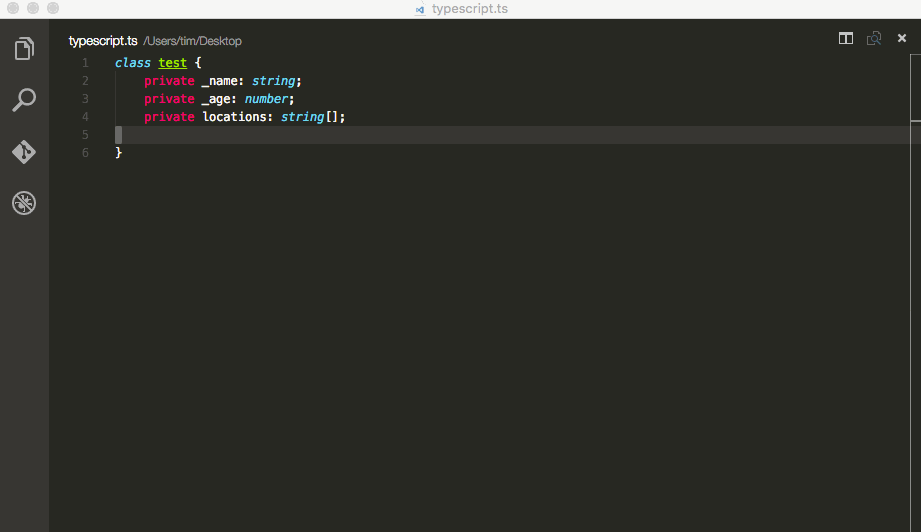
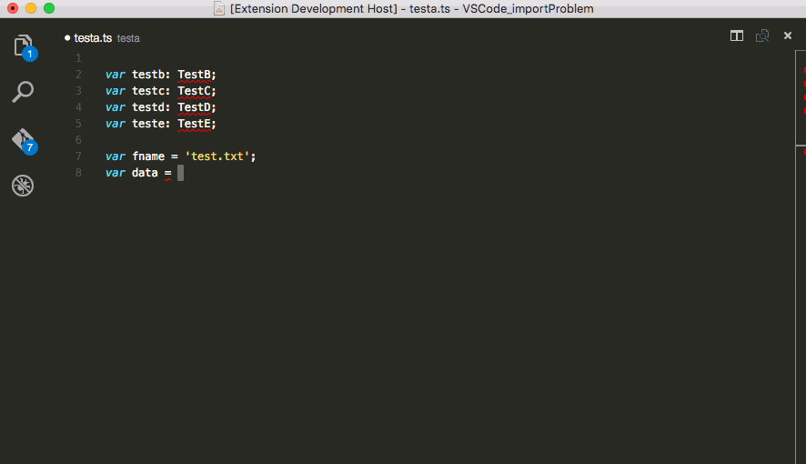

# Generate Imports, Constructors, Getters and Setters


Generate a constructor, get- setters methods based on private variables.


Autocomplete exports from your workspace and generate appropriate import lines.

## Changelog

### v0.2.0
+ added a setting to enable classic getter and setter (disabled by default)

### v0.1.9
+ wildcard import line support based on type definition files
+ intellisense now knows about type definition files
+ fixed import line path issues

### v0.1.8
+ ignore imports when there is already a wildcard import
+ better export detection

### v0.1.7
+ minor bug fixes
+ re-index exports on file save

### v0.1.6
+ import assistant: generate import lines
+ intellisense for exports from other files
+ better error handling
+ import demo screencast 

### v0.1.5
+ updated README
+ added demo screencast

### v0.1.4
+ generate constructor
+ filter already generated getter/setters
+ quick menu with `alt+shift+G`

### v0.1.2
+ generate getter / setter
+ scoped variable listing

## Install
Get VSCode and grab the extension from the [VSCode Extension Market](https://marketplace.visualstudio.com/items?itemName=DSKWRK.vscode-generate-getter-setter)

## Settings

1. `genGetSet.scoped` (default: enabled) switch between scoped or global search for private variables, when scoped only available private definitions from the class where the cursor resides will be shown.
2. `genGetSet.filter` (default: enabled) show only private varaibles which haven't been generated yet based on getter and/or setter selection.
3. `genGetSet.importTypings` (default: enabled) create import wildcard lines based on typing definition files.
4. `genGetSet.classic` (default: disabled) use 'getValue' and 'setValue' instead of 'get value' and 'set value'.
5. `genGetSet.pathStringDelimiter` (default: ') sets which quote use to generate import path.
6. `useSlashForImportPath` (default: false) Use '/' or '\\' in import path

## Usage

1. Just place your cursor within a TypeScript class definition in the text editor window
2. Open the command palette `ctrl+shift+P` / `cmd+shift+P`.
3. Search for 'Generate Getter', 'Setter' or 'Constructor'
4. Select the private variable you would like to generate

or

1. Just place your cursor within a TypeScript class definition in the text editor window
2. Press `alt+shift+G` for a quick selection
3. Select the private variable you would like to generate (or constructor)

The generated method will be placed at the cursors position.

## Best Practice

Best practice is naming your variables with a `_` for private use.
The extension will remove the `_` when generating the methods.

This: `private _name: string;`

Will render in:
```
public get name(): string {
    return this._name;
}

public set name(value: string) {
    this._name = value;
}
```

If there is no `_` the method will start with a `$`.

This: `private name: string;`

Will render in:
```
public get $name(): string {
    return this.name;
}

public set $name(value: string) {
    this.name = value;
}
```

## Known Problems

Always `type` your variables. Even when your variable is being initialized, else the extension cannot read the typing.
Always do this: `private _name: boolean = false;`

Currently only works with TypeScript.
Can easily be extended to other languages. (see github).

**Enjoy!**
